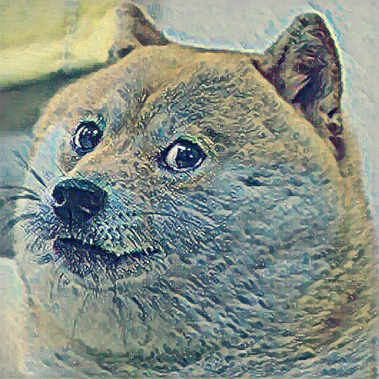
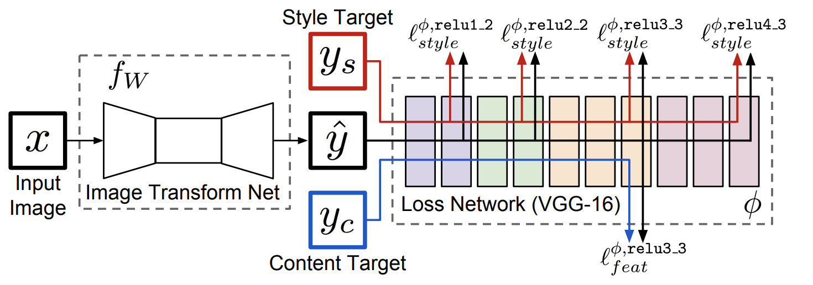

# Mobile Style Transfer

Implementation of Neural Style Transfer based on MobileNet architecture with Sobel loss idea.

<p align = 'center'>


</a>
</p>
<p align = 'center'>
</p>

## Installation

1. Clone this repository:
```bash
git clone https://github.com/ternerss/mobile-style-transfer.git
cd mobile-style-transfer
```
2. install requirements:
```
pip install -r requirements.txt
```
## Usage


Dataset: [COCO 2017 Val images](http://images.cocodataset.org/zips/val2017.zip)

- Train:
 ```bash
python train.py --dataroot data/ --style data/styles/wave.jpeg --batch_size 16 --lr 0.001 --epochs 30
```

- Test:
```bash
python test.py --input data/val/building.jpeg --weights weights mobile_style_transfer.pth --out out/ 
```

## Main idea

 

## References
* [A Neural Algorithm of Artistic Style](https://arxiv.org/abs/1508.06576)
* [Perceptual Losses for Real-Time Style Transfer and Super-Resolution](http://cs.stanford.edu/people/jcjohns/eccv16/)
* [Instance Normalization](https://arxiv.org/abs/1607.08022)
* [MobileNets: Efficient Convolutional Neural Networks for Mobile Vision Applications](https://arxiv.org/pdf/1704.04861.pdf)
